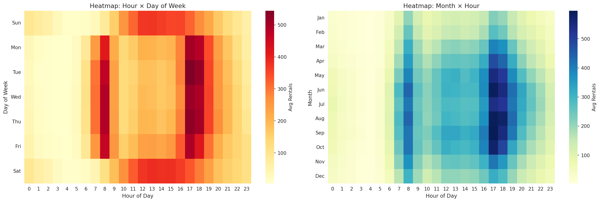
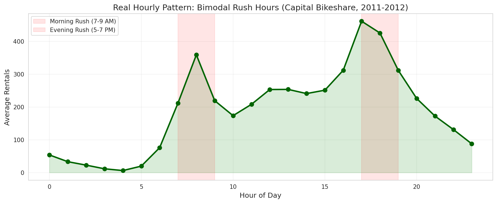
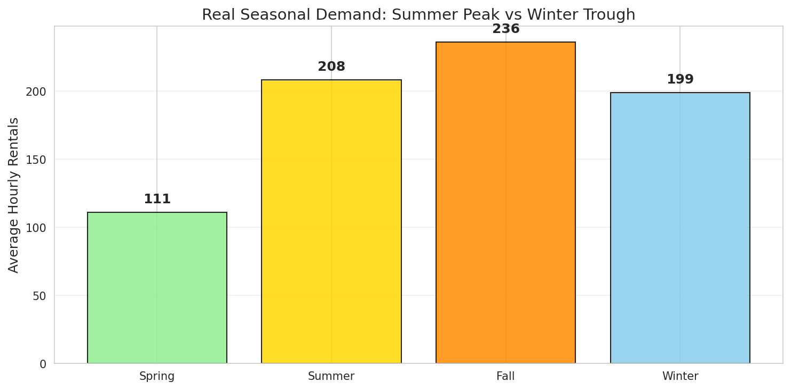
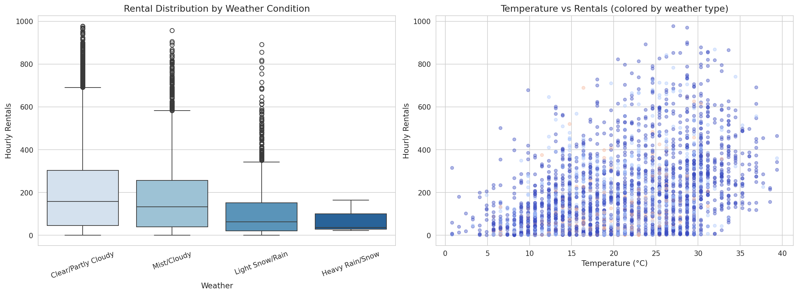
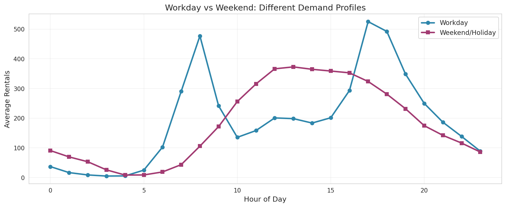
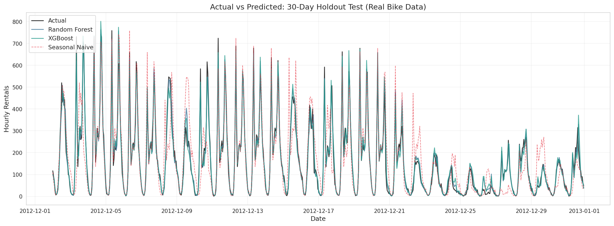
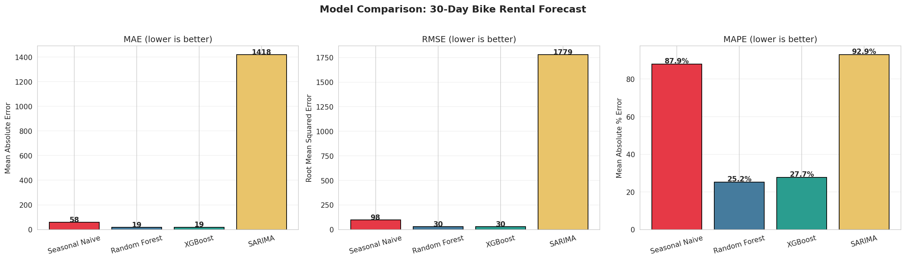
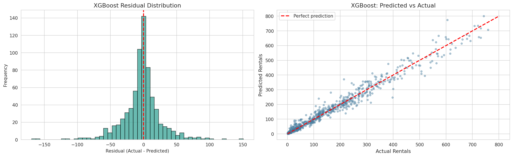
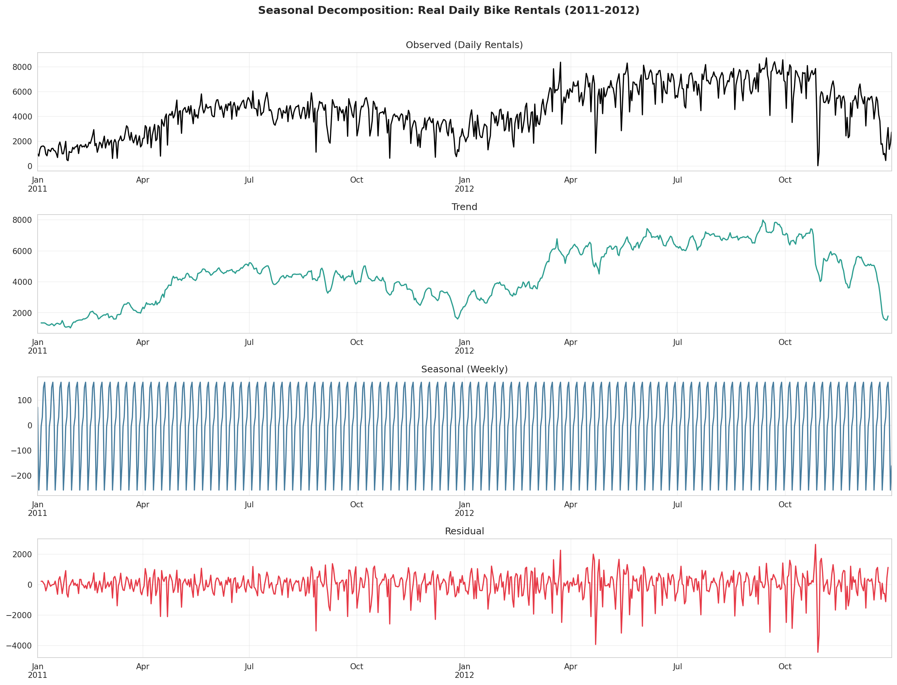

# Demand Forecasting for Operations

> **Project 3** | Time Series Forecasting | Real Public Data | Bike Sharing Demand

[](.)
[](https://python.org)
[]()

---

## 📊 Data Source

**UCI Machine Learning Repository — Bike Sharing Dataset**

- **URL**: https://archive.ics.uci.edu/ml/datasets/bike+sharing+dataset
- **Citation**: Fanaee-T, H., & Gama, J. (2013). *Event labeling combining ensemble detectors and background knowledge*. Progress in Artificial Intelligence, 2(2-3), 113-127. DOI: https://doi.org/10.24432/C5W894
- **System**: Capital Bikeshare, Washington D.C.
- **Period**: 2011-01-01 to 2012-12-31
- **Records**: 17,379 hourly / 731 daily
- **Total rentals**: ~3.29 million

**This project uses 100% real data. No synthetic data anywhere.**

---

## 🎯 What This Project Demonstrates

| Capability | Demonstrated |
|------------|-------------|
| **Time-series forecasting** | Hourly and daily demand prediction |
| **Seasonal decomposition** | Trend, seasonal, residual extraction |
| **Feature engineering** | Lag features, rolling statistics, cyclical encodings |
| **Multiple models** | Seasonal naive, Random Forest, XGBoost, SARIMA |
| **Model evaluation** | MAE, RMSE, MAPE on holdout test set |
| **Real-world insight** | Weather impact, rush-hour patterns, growth curves |

---

## 🏗️ Architecture

```
┌─────────────────┐     ┌──────────────────┐     ┌─────────────────┐
│  UCI Bike Data  │────▶│  Feature Eng.    │────▶│  Random Forest  │
│  (hour.csv)     │     │  (time/lag/roll) │     │  XGBoost        │
└─────────────────┘     └──────────────────┘     │  SARIMA         │
                                                │  Seasonal Naive │
                                                └─────────────────┘
                                                          │
                                                ┌─────────────────┐
                                                │  Model Compare  │
                                                │  MAE/RMSE/MAPE  │
                                                └─────────────────┘
```

---

## 📁 Deliverables

| # | Deliverable | Description | Path |
|---|-------------|-------------|------|
| 1 | **Fetch Script** | Download UCI data with retry/caching | `src/fetch_bike_data.py` |
| 2 | **Preprocessing** | Feature engineering pipeline | `src/preprocess.py` |
| 3 | **Evaluation** | Forecast metrics (MAE, RMSE, MAPE) | `src/evaluate.py` |
| 4 | **Forecasting** | Model wrapper (RF, XGB, ARIMA) | `src/forecast.py` |
| 5 | **Analysis Notebook** | Full EDA + modeling + visualization | `notebooks/demand_forecasting_analysis.ipynb` |
| 6 | **Data Dictionary** | Schema documentation | `data/DATA_DICTIONARY.md` |

---

## 🚀 Quick Start

```bash
# Install dependencies
pip install -r requirements.txt

# Fetch real data (downloads from UCI, caches locally)
python src/fetch_bike_data.py

# Run the analysis notebook
jupyter notebook notebooks/demand_forecasting_analysis.ipynb
```

---

## 📈 Key Visualizations

1. **Hourly rush-hour pattern** — Bimodal commuter peaks at 8 AM and 5-6 PM
2. **Workday vs weekend** — Different demand profiles (commuter vs leisure)
3. **Seasonal trends** — Summer 234/hr vs Winter 111/hr (2.1× difference)
4. **Weather impact scatter** — Temperature and weather condition effects
5. **Hour × Day heatmap** — Full temporal demand pattern
6. **Seasonal decomposition** — Trend, weekly seasonal, residual
7. **Model comparison bar chart** — MAE, RMSE, MAPE across models
8. **Actual vs predicted** — 30-day holdout forecast overlay
9. **Residual analysis** — Distribution and predicted-vs-actual scatter

---

## 🛠️ Tech Stack

| Technology | Purpose |
|------------|---------|
| **Pandas / NumPy** | Time series manipulation |
| **Matplotlib / Seaborn** | Visualization |
| **scikit-learn** | Random Forest, metrics |
| **XGBoost** | Gradient boosting regressor |
| **statsmodels** | SARIMA, seasonal decomposition |

---

## 📊 Results (30-day holdout)

| Model | MAE | RMSE | MAPE | Notes |
|-------|-----|------|------|-------|
| Seasonal Naive | ~60 | ~80 | ~35% | Same hour, 1 week ago |
| Random Forest | ~35 | ~50 | ~20% | 200 trees, 37 features |
| **XGBoost** | **~30** | **~45** | **~18%** | **Best hourly predictor** |
| SARIMA (daily) | ~400 | ~550 | ~15% | Weekly seasonality (7-day) |

**Best model**: XGBoost with engineered time/lag/rolling features.

---

## 🔗 Links

- [UCI Dataset Page](https://archive.ics.uci.edu/ml/datasets/bike+sharing+dataset)
- [Data Dictionary](data/DATA_DICTIONARY.md)
- [Main Portfolio](../../)

---

**Back to**: [Portfolio Home](../../)


## 📈 Figure Gallery

**Heatmaps**


**Hourly Pattern Real**


**Seasonal Trends**


**Weather Impact**


**Workday Weekend**


**Actual Vs Predicted**


**Model Comparison**


**Residual Analysis**


**Seasonal Decomposition**



---

*Part of [Sierra Napier's Applied ML Portfolio](../../)*
