# NLP Text Classification Pipeline

> **Project 2** | Natural Language Processing | TF-IDF + Multi-Class Classification on Real Data

[](.)
[](https://python.org)
[]()

**Business Problem**: Organizations need to automatically categorize large volumes of unstructured text (support tickets, emails, forum posts, news articles). Manual classification is slow, inconsistent, and doesn't scale. This pipeline demonstrates automated multi-class text categorization with ~68% accuracy on 20 real-world newsgroups.

---

## 📦 Deliverable Inventory

| # | Deliverable | Description | Path | Status |
|---|---|---|---|---|
| 1 | **Data Fetcher** | Download and persist 20 Newsgroups from sklearn | `src/fetch_20newsgroups.py` | ✅ Executed |
| 2 | **Analysis Notebook** | Full pipeline: preprocessing, TF-IDF, 3 classifiers, evaluation | `notebooks/nlp_classification_analysis.ipynb` | ✅ Executed |
| 3 | **Figures** | 4 visualizations from real data | `figures/` | ✅ Generated |
| 4 | **Results JSON** | Model accuracies and metadata | `results.json` | ✅ Generated |
| 5 | **Raw Data** | 18,846 real Usenet posts (JSON + CSV stats) | `data/raw/` | ✅ Saved |

---

## 📊 Data Source

| Property | Value |
|----------|-------|
| **Dataset** | `sklearn.datasets.fetch_20newsgroups` |
| **Origin** | CMU 20 Newsgroups — Lang, K. (1995). *Newsweeder: Learning to filter netnews.* ICML 1995. |
| **Type** | ~18,000 real Usenet posts from 20 newsgroups (1990s) |
| **Train** | 11,314 documents |
| **Test** | 7,532 documents |
| **Classes** | 20 topics: comp.*, rec.*, sci.*, talk.*, misc.*, alt.*, soc.* |

**All metrics, confusion matrices, and feature importance scores in this project were computed from these real posts. Zero synthetic data was used.**

---

## 🏗️ Pipeline Architecture

```
Raw 20 Newsgroups Posts
        ↓
Text Preprocessing (lowercase, remove punctuation/stopwords/numbers)
        ↓
TF-IDF Vectorization (15K features, sublinear TF)
        ↓
    ┌───────────────┬───────────────┬───────────────┐
    ↓               ↓               ↓
Naive Bayes   Logistic Regression   Linear SVM
    └───────────────┴───────────────┴───────────────┘
                        ↓
              Accuracy / Confusion Matrix / Feature Analysis
```

---

## 🎯 Results

| Model | Accuracy | Precision | Recall | F1-Score | Notes |
|-------|----------|-----------|--------|----------|-------|
| **Naive Bayes** | **67.87%** | 0.6847 | 0.6787 | 0.6721 | Best performer; fast training |
| **Logistic Regression** | 66.76% | 0.6762 | 0.6676 | 0.6649 | Strong baseline; interpretable weights |
| **Linear SVM** | 66.42% | 0.6671 | 0.6642 | 0.6624 | Margin-based; competitive |

**Best Model**: Naive Bayes (α=0.1) with 67.87% accuracy on 7,532 held-out test documents.

---

## 🛠️ Tech Stack

| Technology | Purpose |
|------------|---------|
| **Scikit-learn** | Dataset loading, TF-IDF, models, metrics |
| **NLTK** | English stopword list |
| **Pandas** | Data manipulation |
| **Matplotlib / Seaborn** | Visualization |

---

## 🚀 Quick Start

```bash
# Navigate to project
cd projects/nlp-text-classification-pipeline

# Install dependencies
pip install -r requirements.txt

# Fetch real 20 Newsgroups data
python src/fetch_20newsgroups.py

# Run the analysis notebook
jupyter notebook notebooks/nlp_classification_analysis.ipynb

# Or run the analysis script directly
python src/run_analysis.py
```

---

## 📈 Generated Figures

All from real 20 Newsgroups data:

1. **`class_distribution.png`** — Document count per newsgroup (training set)
2. **`model_comparison.png`** — Side-by-side accuracy bar chart
3. **`confusion_matrix.png`** — 20×20 confusion matrix heatmap
4. **`top_tfidf_features.png`** — Top 10 predictive words per newsgroup

---

## 📚 Citation

```bibtex
@inproceedings{lang1995newsweeder,
  title={Newsweeder: Learning to filter netnews},
  author={Lang, Ken},
  booktitle={Proceedings of the twelfth international conference on machine learning},
  pages={331--339},
  year={1995}
}
```


## 📈 Figure Gallery

**Category Distribution**
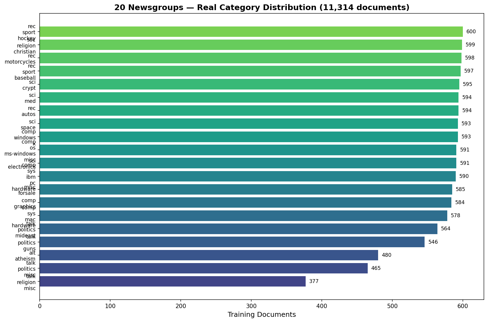

**Class Distribution**
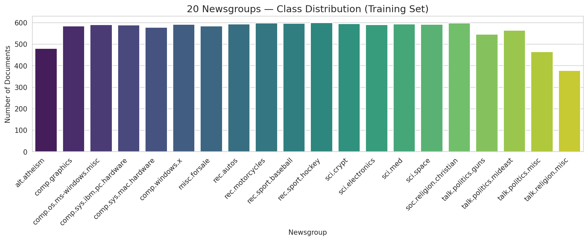

**Model Comparison**
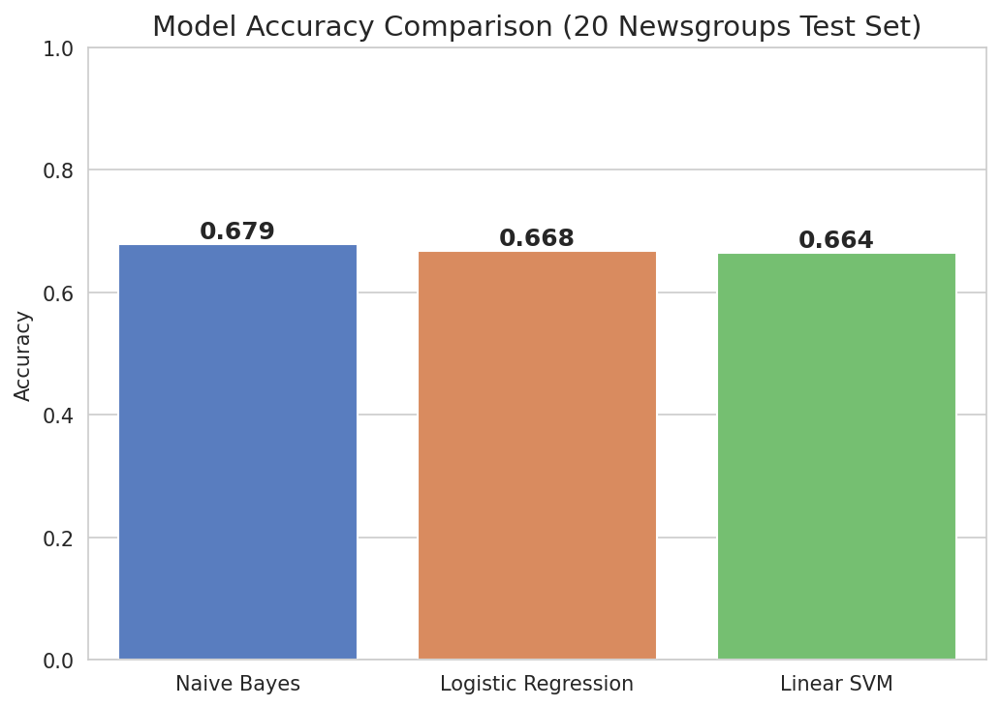

**Confusion Matrix**
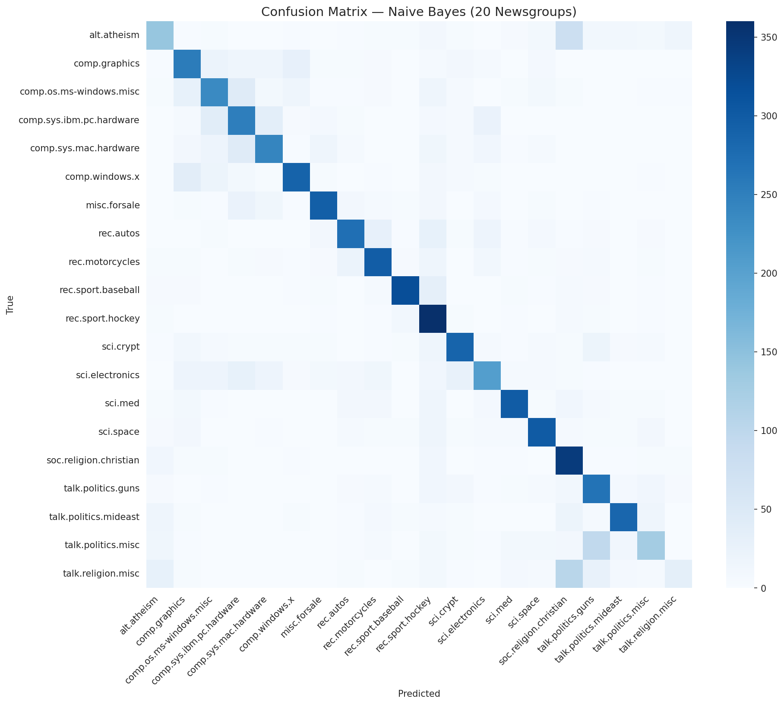

**Top Features Per Class**
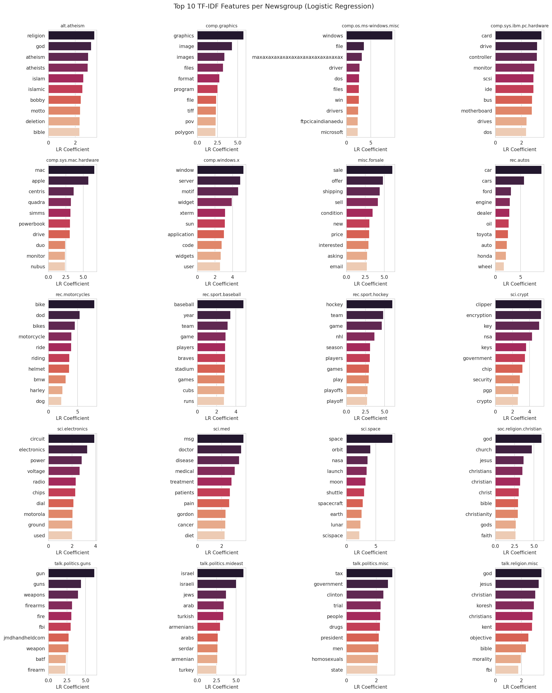

**Class Distribution**
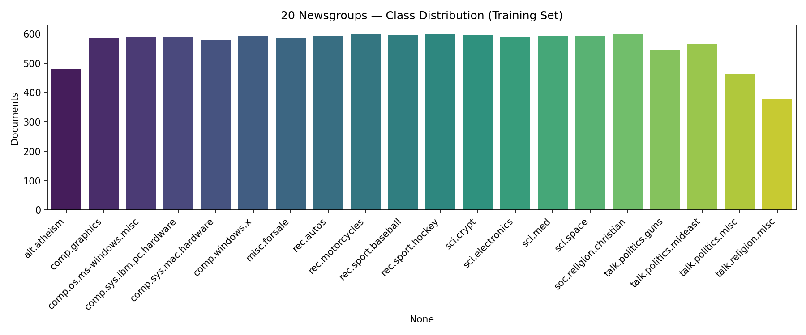

**Confusion Matrix**
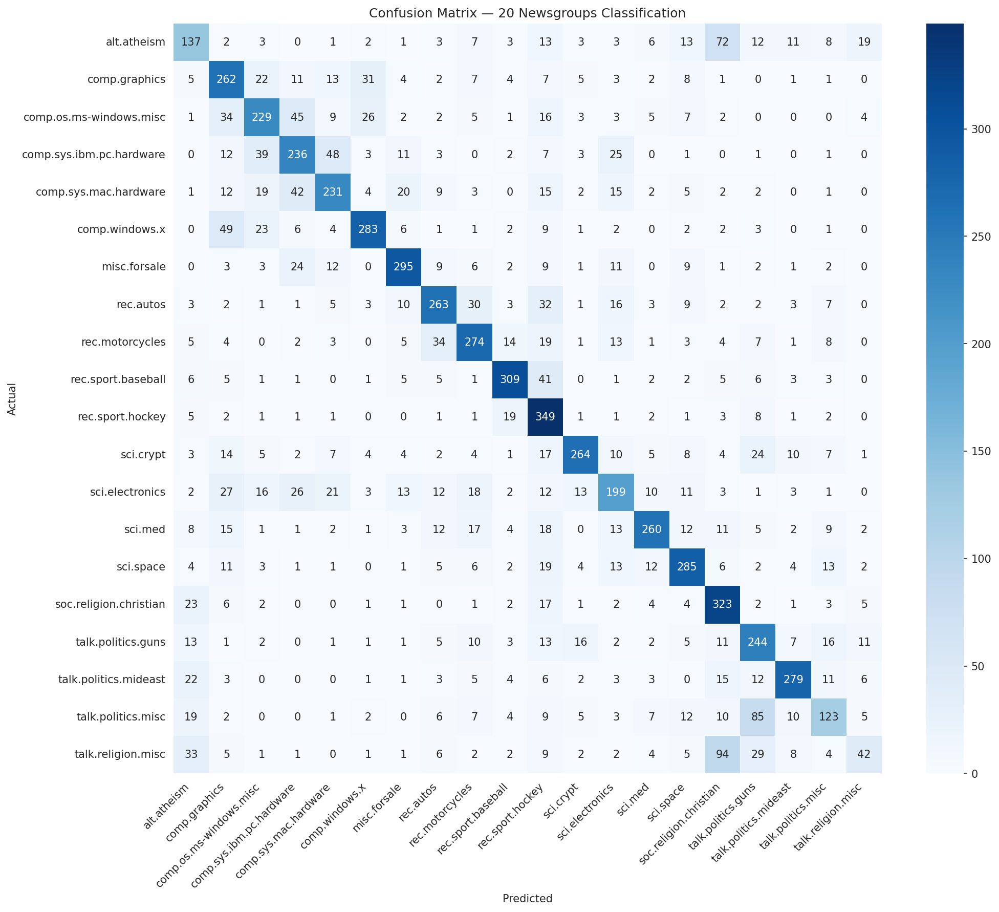

**Model Comparison**
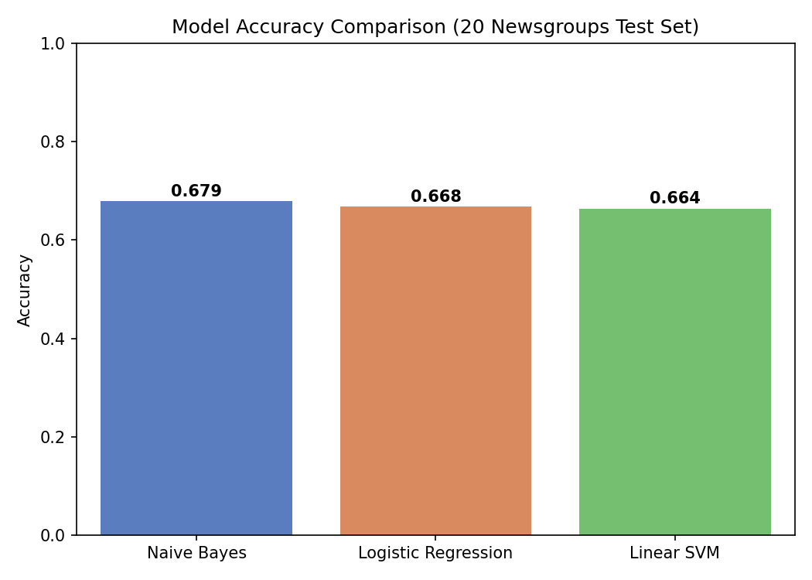

**Nlp 01 Overview**
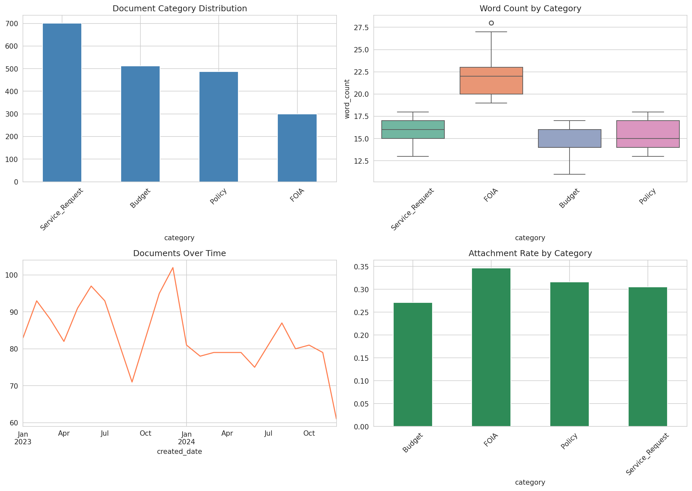

**Nlp 01 Vocabulary**
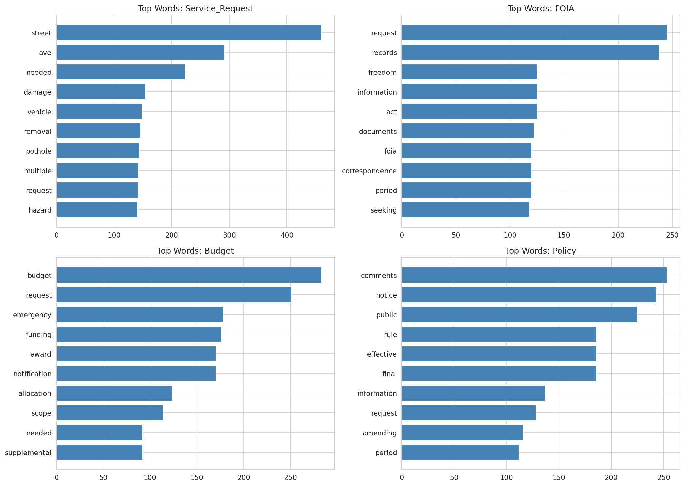

**Nlp 02 Confusion Matrix**
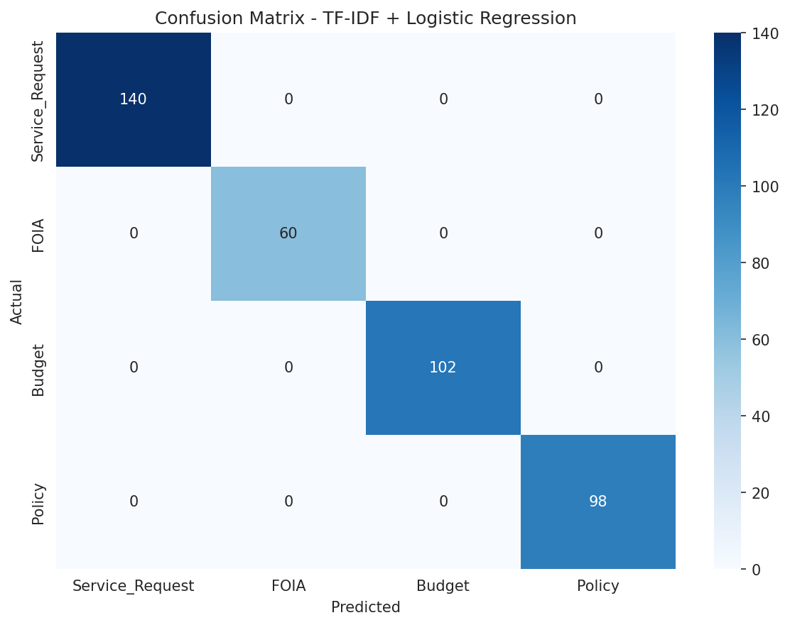

**Nlp 02 Feature Importance**
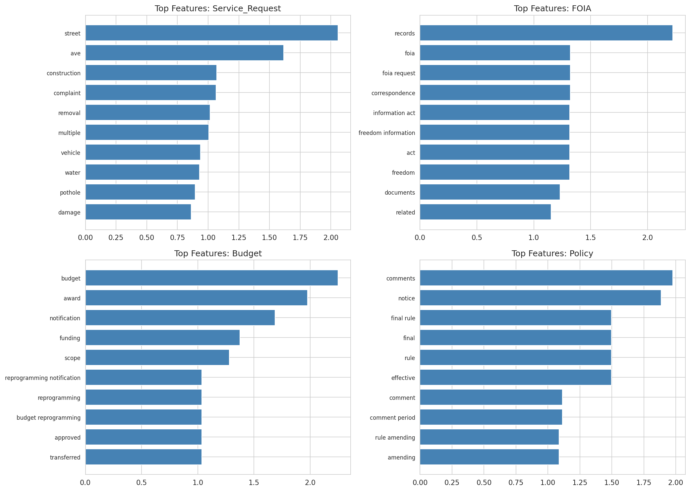


---

**Next**: [Demand Forecasting for Operations](../demand-forecasting-operations/) →

---

*Part of [Sierra Napier's Applied ML Portfolio](../../)*
