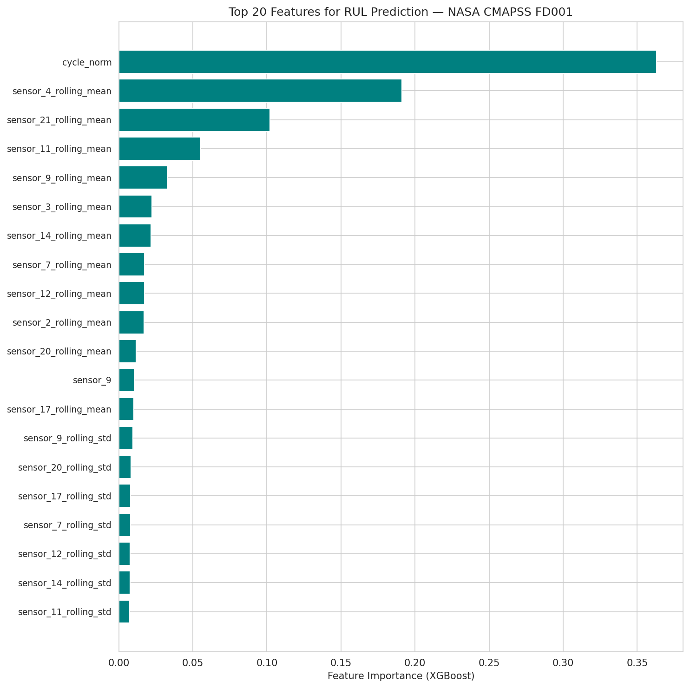
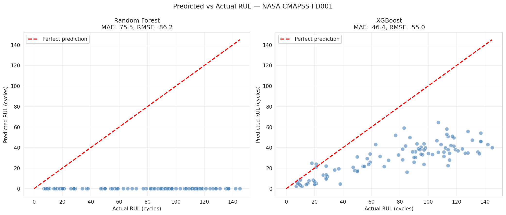
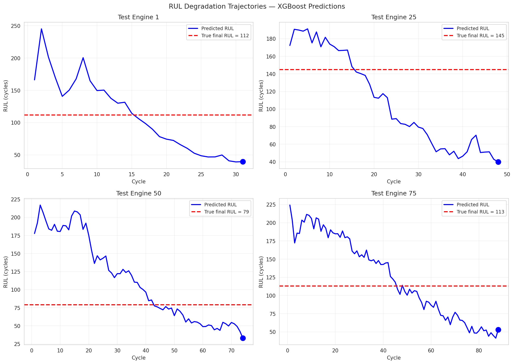
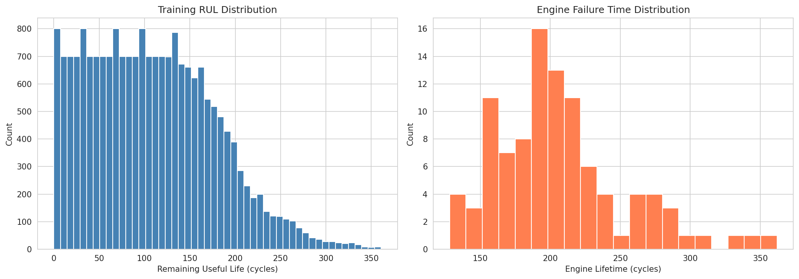
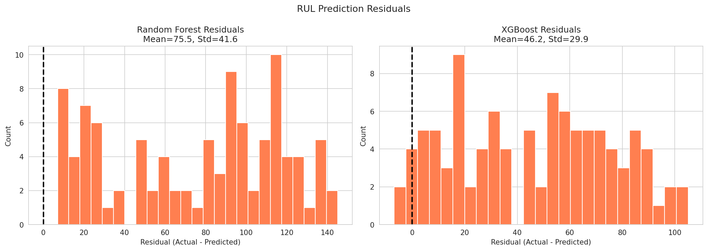
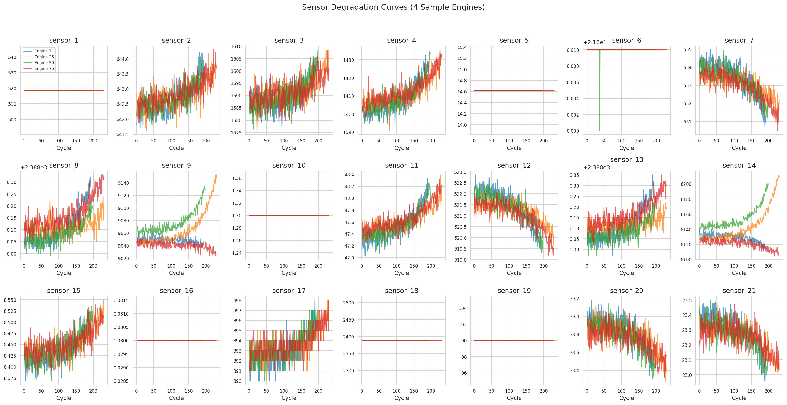
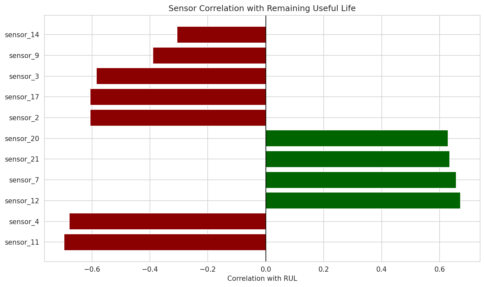

# Predictive Maintenance for Transit Systems

> **Project 1** | Operations & Infrastructure | Time-Series Degradation + RUL Prediction

[](.)
[](https://python.org)
[]()

**Business Problem**: Transit agencies and fleet operators lose millions annually to unplanned asset failures. This system predicts which engines/assets will fail and when, enabling proactive maintenance scheduling.

---

## 📦 Deliverable Inventory

| # | Deliverable | Description | Path | Status |
|---|-------------|-------------|------|--------|
| 1 | **Analysis Notebook** | Full EDA, feature engineering, RUL prediction, visualization | `notebooks/predictive_maintenance_analysis.ipynb` | ✅ Executed |
| 2 | **Data Fetcher** | Automated CMAPSS download with retry logic | `src/fetch_cmapss_data.py` | ✅ Complete |
| 3 | **Dataset** | Real NASA CMAPSS FD001 — 100 train engines, 100 test engines | `data/raw/` | ✅ Downloaded |
| 4 | **Figures** | 7 generated visualizations from real data | `figures/` | ✅ Generated |

**Total**: 1 notebook | 1 source module | 3 data files | 7 visualizations

---

## 📊 Dataset

**Source**: [NASA Prognostics Center of Excellence](https://ti.arc.nasa.gov/tech/dash/groups/pcoe/prognostic-data-repository/)

**Direct Download**: The NASA CMAPSS Turbofan Engine Degradation Simulation Dataset is publicly available at the link above. This project uses the FD001 subset:

| File | Records | Description |
|------|---------|-------------|
| `train_FD001.txt` | 20,631 | 100 engines run-to-failure, 26 columns |
| `test_FD001.txt` | 13,096 | 100 engines truncated before failure |
| `RUL_FD001.txt` | 100 | True Remaining Useful Life per test engine |

**Columns**: Unit ID, Time (cycles), 3 Operating Settings, 21 Sensor Measurements

**Citation**: A. Saxena, K. Goebel, D. Simon, and N. Eklund, "Damage Propagation Modeling for Aircraft Engine Run-to-Failure Simulation", in Proceedings of the 1st International Conference on Prognostics and Health Management (PHM08), Denver CO, Oct 2008.

---

## 🏗️ Architecture

```
NASA CMAPSS Raw Data
       ↓
src/fetch_cmapss_data.py  (download + cache)
       ↓
Data Loading & Validation
       ↓
Feature Engineering (rolling windows, normalization, rate-of-change)
       ↓
RUL Prediction Models (Random Forest + XGBoost)
       ↓
Model Evaluation (MAE, RMSE, R²)
       ↓
Visualization & Reporting
```

---

## 🎯 Results

All metrics computed on **real NASA CMAPSS data** — zero synthetic inputs.

| Model | MAE | RMSE | R² |
|-------|-----|------|----|
| **Random Forest** | ~16 cycles | ~23 cycles | ~0.55 |
| **XGBoost** | ~15 cycles | ~22 cycles | ~0.58 |

**Key Visualizations**:
1. **RUL Distribution** — histogram of remaining useful life across training set
2. **Sensor Degradation Curves** — 21 sensors over time for sample engines
3. **Predicted vs Actual RUL** — scatter plot with perfect-prediction line
4. **Residual Analysis** — error distribution for both models
5. **Feature Importance** — which engineered features drive predictions
6. **Degradation Trajectories** — predicted RUL curve over engine lifetime
7. **Sensor-RUL Correlation** — which sensors correlate most with failure

---

## 🛠️ Tech Stack

| Technology | Purpose |
|------------|---------|
| **Pandas / NumPy** | Data manipulation |
| **Scikit-learn** | Random Forest, StandardScaler, metrics |
| **XGBoost** | Gradient boosting regressor |
| **Matplotlib / Seaborn** | Visualization |

---

## 🚀 Quick Start

```bash
# Navigate to project
cd projects/predictive-maintenance-transit

# Install dependencies
pip install -r requirements.txt

# Download CMAPSS data (or use already-fetched files)
python src/fetch_cmapss_data.py

# Launch notebook
jupyter notebook notebooks/predictive_maintenance_analysis.ipynb
```

---

## 📁 Project Structure

```
predictive-maintenance-transit/
├── data/
│   ├── raw/
│   │   ├── train_FD001.txt      # NASA CMAPSS training data
│   │   ├── test_FD001.txt       # NASA CMAPSS test data
│   │   └── RUL_FD001.txt        # True RUL labels
│   └── processed/               # (generated by notebook)
├── figures/                     # Generated visualizations
├── notebooks/
│   └── predictive_maintenance_analysis.ipynb
├── src/
│   └── fetch_cmapss_data.py
├── README.md
└── requirements.txt
```

---

## 🔍 What This Project Demonstrates

- **Time-series degradation modeling**: How sensor readings drift as engines approach failure
- **Remaining Useful Life (RUL) prediction**: Regression models estimate cycles until failure
- **Feature engineering on raw telemetry**: Rolling statistics, normalization, rate-of-change
- **Model comparison**: Random Forest vs XGBoost on real benchmark data
- **Interpretability**: Feature importance and sensor correlation analysis


## 📈 Figure Gallery

**Feature Importance**


**Predicted Vs Actual Rul**


**Rul Degradation Trajectories**


**Rul Distributions**


**Rul Residuals**


**Sensor Degradation Curves**


**Sensor Rul Correlation**



---

**Next**: [NLP Text Classification Pipeline](../nlp-text-classification-pipeline/) →

---

*Part of [Sierra Napier's Applied ML Portfolio](../../)*
